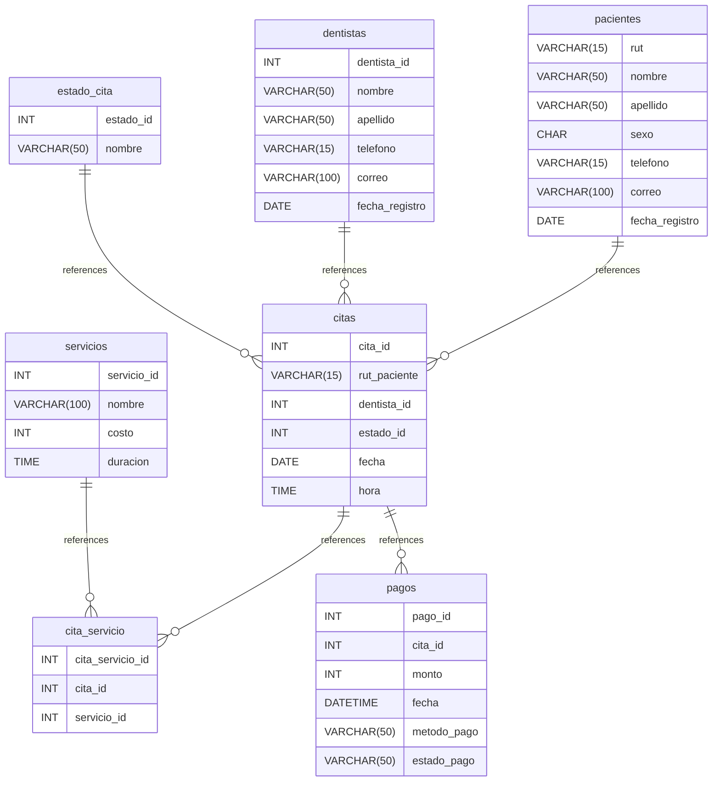

# clinica-dental_ev03 documentation
## Summary

- [Introduction](#introduction)
- [Database Type](#database-type)
- [Table Structure](#table-structure)
    - [pacientes](#pacientes)
    - [dentistas](#dentistas)
    - [servicios](#servicios)
    - [estado_cita](#estado_cita)
    - [citas](#citas)
    - [cita_servicio](#cita_servicio)
    - [pagos](#pagos)
- [Relationships](#relationships)
- [Database Diagram](#database-diagram)

## Introduction

## Database type

- **Database system:** Generic
## Table structure

### pacientes

| Name        | Type          | Settings                      | References                    | Note                           |
|-------------|---------------|-------------------------------|-------------------------------|--------------------------------|
| **rut** | VARCHAR(15) | 🔑 PK, null, unique | fk_pacientes_rut_citas | |
| **nombre** | VARCHAR(50) | not null |  | |
| **apellido** | VARCHAR(50) | not null |  | |
| **sexo** | CHAR | not null |  |M o F |
| **telefono** | VARCHAR(15) | null |  | |
| **correo** | VARCHAR(100) | null |  | |
| **fecha_registro** | DATE | null, default: [object Object] |  | | 

### dentistas

| Name        | Type          | Settings                      | References                    | Note                           |
|-------------|---------------|-------------------------------|-------------------------------|--------------------------------|
| **dentista_id** | INT | 🔑 PK, null, unique, autoincrement | fk_dentistas_dentista_id_citas | |
| **nombre** | VARCHAR(50) | not null |  | |
| **apellido** | VARCHAR(50) | not null |  | |
| **telefono** | VARCHAR(15) | null |  | |
| **correo** | VARCHAR(100) | null |  | |
| **fecha_registro** | DATE | null, default: [object Object] |  | | 

### servicios

| Name        | Type          | Settings                      | References                    | Note                           |
|-------------|---------------|-------------------------------|-------------------------------|--------------------------------|
| **servicio_id** | INT | 🔑 PK, null, unique, autoincrement | fk_servicios_servicio_id_cita_servicio | |
| **nombre** | VARCHAR(100) | not null |  | |
| **costo** | INT | not null, default: [object Object] |  |Debe ser > 0 |
| **duracion** | TIME | not null |  | | 

### estado_cita

| Name        | Type          | Settings                      | References                    | Note                           |
|-------------|---------------|-------------------------------|-------------------------------|--------------------------------|
| **estado_id** | INT | 🔑 PK, null, unique, autoincrement | fk_estado_cita_estado_id_citas | |
| **nombre** | VARCHAR(50) | not null |  |Programada, Confirmada, Completada, Cancelada, Reprogramada | 

### citas

| Name        | Type          | Settings                      | References                    | Note                           |
|-------------|---------------|-------------------------------|-------------------------------|--------------------------------|
| **cita_id** | INT | 🔑 PK, null, unique, autoincrement | fk_citas_cita_id_cita_servicio,fk_citas_cita_id_pagos | |
| **rut_paciente** | VARCHAR(15) | not null |  | |
| **dentista_id** | INT | not null |  | |
| **estado_id** | INT | not null |  | |
| **fecha** | DATE | not null |  | |
| **hora** | TIME | not null |  | | 

### cita_servicio

| Name        | Type          | Settings                      | References                    | Note                           |
|-------------|---------------|-------------------------------|-------------------------------|--------------------------------|
| **cita_servicio_id** | INT | 🔑 PK, null, unique, autoincrement |  | |
| **cita_id** | INT | not null |  | |
| **servicio_id** | INT | not null |  | | 

### pagos

| Name        | Type          | Settings                      | References                    | Note                           |
|-------------|---------------|-------------------------------|-------------------------------|--------------------------------|
| **pago_id** | INT | 🔑 PK, null, unique, autoincrement |  | |
| **cita_id** | INT | not null |  | |
| **monto** | INT | not null |  |Debe ser > 0 |
| **fecha** | DATETIME | not null |  | |
| **metodo_pago** | VARCHAR(50) | not null |  |Efectivo, Tarjeta de Credito, Transferencia |
| **estado_pago** | VARCHAR(50) | not null |  |Pagado, Pendiente, Reembolso | 

## Relationships

- **pacientes to citas**: one_to_many
- **dentistas to citas**: one_to_many
- **estado_cita to citas**: one_to_many
- **citas to cita_servicio**: one_to_many
- **servicios to cita_servicio**: one_to_many
- **citas to pagos**: one_to_many

## Database Diagram

